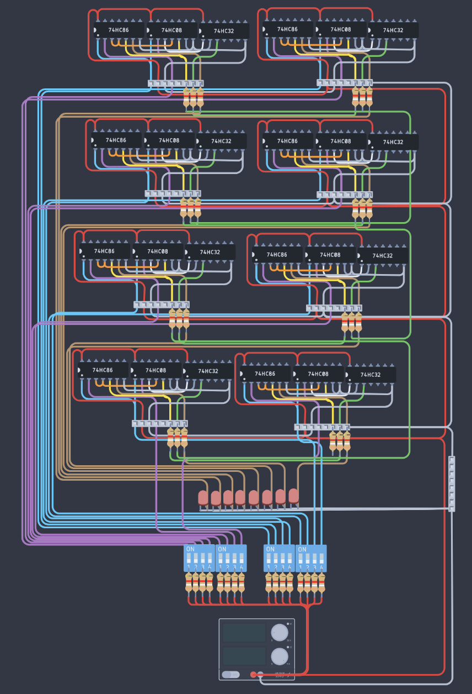
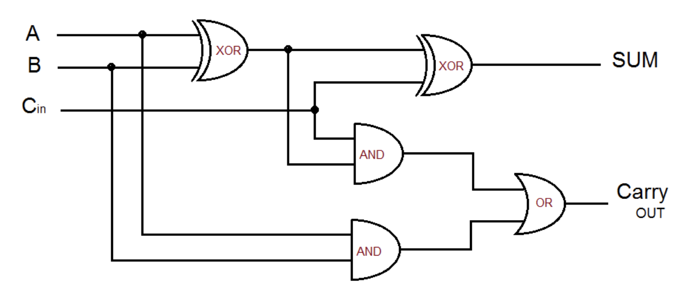

# Eight-Bit Truncated Adder

## Overview

This repository hosts the design and implementation of an Eight-Bit Adder circuit. The Eight-Bit Adder is a digital circuit that performs addition of two 8-bit binary numbers. The output is also an 8-bit binary number, and any overflow is truncated. This project is ideal for those interested in digital electronics and circuit design.

## Circuit Components

The Eight-Bit Adder is built using the following components:
- **16x XOR Gates**: SN74AHC1G86DBVR 296-1094-1-ND
- **16x AND Gates**: SN74LVC1G08DCKR 296-11602-1-ND
- **8x OR Gates**: SN74LVC1G32DCKR 296-9848-1-ND
- **2x 8-lane DIP Switches**: For input
- **8x LED Diodes**: For output display
- **24x 1 Ohm Resistors**

## Schematic Diagrams

Detailed schematic diagrams of the Eight-Bit Adder can be found [here](docs/images/schematics).

## Tinkercad Simulation

Experience the Eight-Bit Adder in action through a Tinkercad simulation. Check it out [here](https://www.tinkercad.com/things/2VmVofHmi9q-eight-bit-truncated-adder-leif-huender).

## How It Works

The Eight-Bit Adder uses a combination of XOR, AND, and OR gates to compute the sum of two 8-bit numbers. The core of this circuit is the Full Adder logic, where each bit of the input numbers is added along with a carry from the previous bit. Here's a brief overview of the role of each component:
- **XOR Gates**: Used in the initial stage of each bit addition to compute the basic sum.
- **AND Gates**: Utilized to determine the carry that will be passed to the next bit in the sequence.
- **OR Gates**: Employed to combine carries from different paths in the adder circuit.

## Getting Started
To get started with this project:
1. Clone the repository to your local machine.
2. Refer to the schematic diagrams to understand the circuit layout.
3. Use the Tinkercad simulation to experiment with the circuit virtually.

## License
This project is licensed under the [MIT License](LICENSE) - see the LICENSE.md file for details.

---